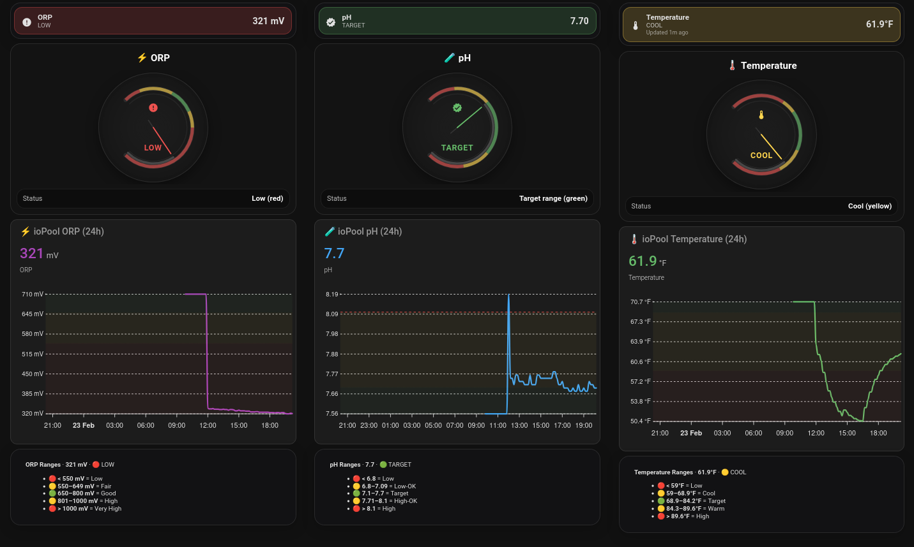
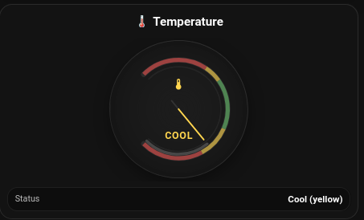
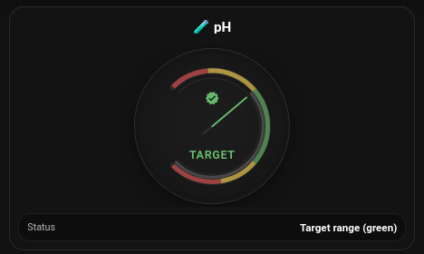
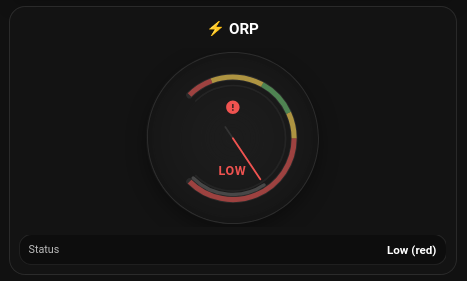

# ioPool Spa Monitoring Dashboard for Home Assistant


Beautiful Home Assistant dashboard cards for monitoring **spa water temperature, pH, and ORP** from an ioPool sensor, with:

- compact status rows
- 270° SVG gauge cards (aligned thresholds + needle)
- 24h ApexCharts history graphs
- range reference markdown cards
- color-coded target zones for quick at-a-glance checks

---

## Features

- ✅ **Temperature, pH, and ORP support**
- ✅ **Color-coded threshold ranges** (red / yellow / green / yellow / red)
- ✅ **270° SVG gauges** with properly aligned arcs + needle
- ✅ **Compact summary/status rows** for each metric
- ✅ **ApexCharts 24-hour history** with threshold shading
- ✅ **Markdown range legend cards** for quick reference
- ✅ **Home Assistant button-card compatible**
- ✅ **Easy to customize ranges, icons, colors, and labels**

---

## Screenshots

> Add screenshots here (recommended)

### Dashboard Overview


### Temperature Gauge


### pH Gauge


### ORP Gauge


---

## Prerequisites

- **Home Assistant** (Dashboard / Lovelace)
- **ioPool integration / entities** available in HA
- **custom:button-card** (via HACS)
- **custom:apexcharts-card** (via HACS)
- *(Optional)* **card-mod** for styling markdown cards

---

## Entities Used

This dashboard example uses these entities:

- `sensor.iopool_saluspa_bahama_temperature`
- `sensor.iopool_saluspa_bahama_ph`
- `sensor.iopool_saluspa_bahama_orp`

If your entity names differ, replace them in the YAML files.

---

## Threshold Ranges

### Temperature (°F)
- 🔴 **< 59.0** = Low
- 🟡 **59.0 – 68.9** = Cool
- 🟢 **68.9 – 84.2** = Target
- 🟡 **84.2 – 89.6** = Warm
- 🔴 **> 89.6** = High

### pH
- 🔴 **< 6.8** = Low
- 🟡 **6.8 – 7.09** = Low-OK
- 🟢 **7.1 – 7.7** = Target
- 🟡 **7.71 – 8.1** = High-OK
- 🔴 **> 8.1** = High

### ORP (mV)
- 🔴 **< 550** = Low
- 🟡 **550 – 649** = Fair
- 🟢 **650 – 800** = Good
- 🟡 **801 – 1000** = High
- 🔴 **> 1000** = Very High

> Adjust these to match your spa chemistry targets and sanitizer approach.

---

## Quick Start

1. Install required Lovelace custom cards:
   - `button-card`
   - `apexcharts-card`
   - *(optional)* `card-mod`

2. Confirm your ioPool sensor entities exist in **Developer Tools → States**

3. Copy the YAML cards from this repo into your dashboard:
   - Compact status row cards
   - Gauge cards
   - ApexCharts cards
   - Range markdown cards

4. Update entity IDs to match your system

5. Add cards to your dashboard (stack or individual placement)

---

## Included Cards

This project includes **three card groups** (one per metric):

- **Temperature**
  - Compact status row
  - 270° gauge card
  - 24h Apex chart
  - Range legend markdown card

- **pH**
  - Compact status row
  - 270° gauge card
  - 24h Apex chart
  - Range legend markdown card

- **ORP**
  - Compact status row
  - 270° gauge card
  - 24h Apex chart
  - Range legend markdown card

---

## How the Gauge Works (270° SVG)

The gauge uses a **270° sweep** instead of a full 360° circle so the visual scale matches the pointer more naturally.

### Key ideas
- `minV` / `maxV` define the display range
- Value is converted into a **normalized percent**
- Percent is mapped to a **gauge-local angle (0..270)**
- A helper function maps gauge-local angle to **screen degrees**
- Threshold breakpoints are converted into matching arc segments
- Needle position uses the exact same angle mapping (critical for alignment)

This keeps:
- ✅ outer colored threshold arcs
- ✅ inner progress arc
- ✅ pointer needle  
all in the **same coordinate system**

---

## File Structure

```text
.
├── cards/
│   ├── temperature/
│   │   ├── temperature_status_row.yaml
│   │   ├── temperature_gauge_card.yaml
│   │   ├── temperature_apexchart_24h.yaml
│   │   └── temperature_ranges_markdown.yaml
│   ├── ph/
│   │   ├── ph_status_row.yaml
│   │   ├── ph_gauge_card.yaml
│   │   ├── ph_apexchart_24h.yaml
│   │   └── ph_ranges_markdown.yaml
│   └── orp/
│       ├── orp_status_row.yaml
│       ├── orp_gauge_card.yaml
│       ├── orp_apexchart_24h.yaml
│       └── orp_ranges_markdown.yaml
├── examples/
│   ├── vertical_stack_example.yaml
│   └── dashboard_section_example.yaml
├── docs/
│   ├── screenshots/
│   │   ├── dashboard-overview.png
│   │   ├── temperature-gauge.png
│   │   ├── ph-gauge.png
│   │   └── orp-gauge.png
│   ├── INSTALLATION.md
│   ├── CUSTOMIZATION.md
│   └── TROUBLESHOOTING.md
├── LICENSE
└── README.md
